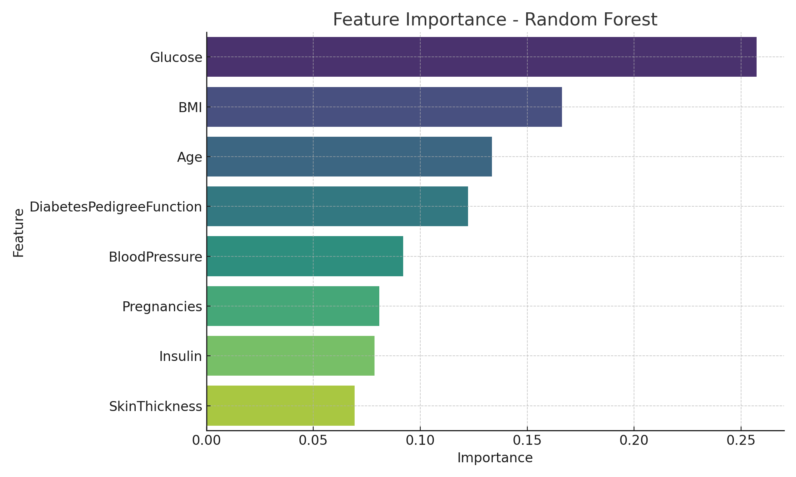

# 🩺 Diabetes Prediction System using Naïve Bayes and Random Forest

This project is part of my undergraduate thesis at Universitas Bandar Lampung, focused on building a machine learning system to diagnose diabetes using **Naïve Bayes** and **Random Forest** algorithms. The system was developed using Python and Jupyter Notebook, and evaluated using a Kaggle dataset.

---

## 📊 Dataset Description

The dataset used for this project is sourced from [Kaggle](https://www.kaggle.com/datasets), and consists of 768 samples with 8 clinical features:

- Pregnancies
- Glucose
- BloodPressure
- SkinThickness
- Insulin
- BMI
- DiabetesPedigreeFunction
- Age  
- Outcome (target variable: 0 = No Diabetes, 1 = Diabetes)

---

## ⚙️ Machine Learning Algorithms Used

### 1. Naïve Bayes
- Probabilistic classifier based on Bayes' theorem
- Fast and simple, good for baseline models

### 2. Random Forest
- Ensemble method using multiple decision trees
- Capable of handling nonlinear relationships and interactions
- Feature importance visualization provided

---

## 📈 Results & Accuracy

| Model         | Accuracy |
|---------------|----------|
| Naïve Bayes   | 75.32%   |
| Random Forest | 81.17%   |

- Random Forest outperformed Naïve Bayes in accuracy and feature handling.
- Feature importance shows **Glucose**, **BMI**, and **Age** are top predictors.



---

## 📂 Files Included

| File Name                      | Description                                |
|-------------------------------|--------------------------------------------|
| `diabetes_prediction.ipynb`   | Jupyter Notebook with full workflow        |
| `diabetes2.csv`               | Cleaned dataset used in training           |
| `feature_importance.png`      | Bar plot showing Random Forest importance  |
| `README.md`                   | Project description and documentation      |

---

## 🛠️ How to Run This Project

1. Clone this repository:
   ```bash
   git clone https://github.com/your-username/diabetes-prediction.git
   cd diabetes-prediction
   ```

2. Install required libraries:
   ```bash
   pip install pandas matplotlib seaborn scikit-learn
   ```

3. Run the notebook:
   ```bash
   jupyter notebook diabetes_prediction.ipynb
   ```

Or you can open directly in **Google Colab**:
[](https://colab.research.google.com/github/your-username/diabetes-prediction/blob/main/diabetes_prediction.ipynb)

---

## 👨‍🎓 About Me

I am a graduate of Informatics Engineering at Universitas Bandar Lampung, passionate about data science and artificial intelligence. This project represents my first step into real-world machine learning applications, and I am currently seeking opportunities to work and grow in the data analytics or data science field.

📫 Feel free to connect with me on [LinkedIn]([https://www.linkedin.com/](https://www.linkedin.com/in/wayan-nurfidi-9a410034b?trk=contact-info) or reach out via email!

---

## ⭐ Star This Repository

If you find this project helpful, please give it a ⭐ and share it with others. It helps a lot!
